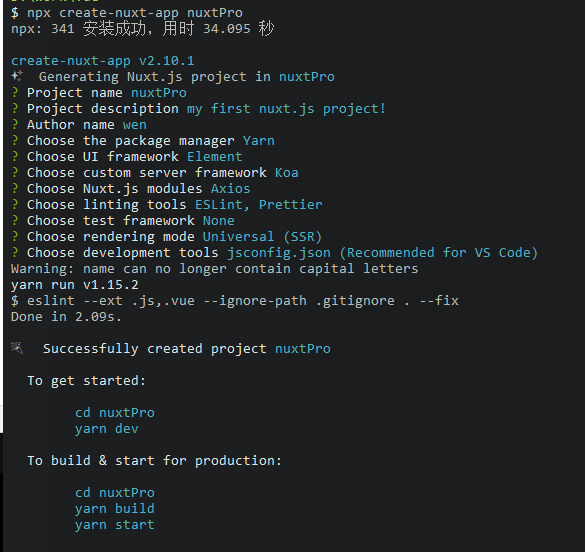

# nuxtPro

> my first nuxt.js project!

## Build Setup

``` bash
# install dependencies
$ yarn install

# serve with hot reload at localhost:3000
$ yarn dev

# build for production and launch server
$ yarn build
$ yarn start

# generate static project
$ yarn generate
```

For detailed explanation on how things work, check out [Nuxt.js docs](https://nuxtjs.org).

### 本地创建nuxt.js的步骤以及选项



```js
// 使用npx(仅仅针对本项目安装)，可以本地安装最新版的nuxt.js，避免全局安装时，警告有最新版，需要更新的问题
npx create-nuxt-app project-name

// 随后依次选取自己相关的module

// 在选择choose rendering mode 时候，选择 Universal(SSR)，这样才是服务端渲染，不然依旧是SPA

choose rendering mode: Universal(SSR)

```

具体内容参考 [nuxt指引](https://zh.nuxtjs.org/guide/installation/)

